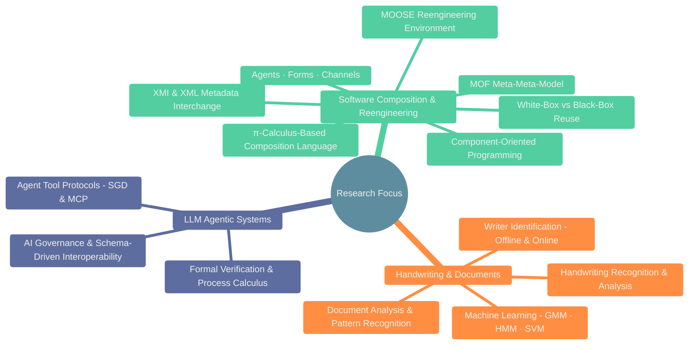
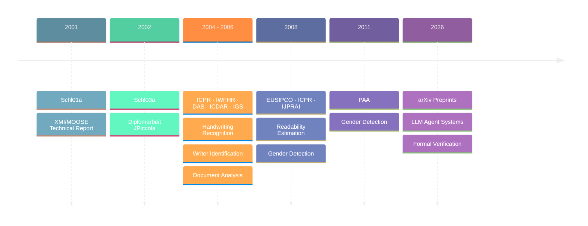

# Andreas Schlapbach's Publications

A curated collection of academic papers and research publications. The early
work explores two foundational ideas in software engineering: the **π-calculus**
as a formal basis for component composition languages, and the **Meta-Object
Facility (MOF)** as a meta-meta-model for language-independent metamodel
interchange via XMI.

Later work applies **machine learning** (Gaussian Mixture Models, Hidden Markov
Models, Support Vector Machines) to handwriting recognition and writer
identification,

Recent research focuses on the design and formal verification of **LLM agentic
systems**, proposing new paradigms for agent interoperability and tool protocol
semantics.

This repository serves as a comprehensive archive of these contributions,
spanning from foundational software composition theories to cutting-edge AI
agent research.

## Publications

1. [The Convergence of SGD and MCP: A New Paradigm for Agentic Interoperability](2602.18764v2.pdf)
   (arXiv, 2026)
2. [Formal Semantics for Agentic Tool Protocols: A Process Calculus Approach](2603.24747v1.pdf)
   (arXiv, 2026)
3. Automatic Gender Detection Using on-Line and Off-Line Information
   (Pattern Analysis and Applications, 14(1):87–92, 2011;
   DOI: [10.1007/s10044-010-0178-6](https://doi.org/10.1007/s10044-010-0178-6))
4. [Automatic Gender Detection – Combining On-Line and Off-Line Systems](ijprai2008.pdf)
   (International Journal of Pattern Recognition and Artificial
   Intelligence, 2008)
5. [Automatic Estimation of the Readability of Handwritten Text](eusipco08.pdf)
   (EUSIPCO 2008)
6. [Estimating the Readability of Handwritten Text – A Support Vector Regression Based Approach](icpr08.pdf)
   (ICPR 2008)
7. [Machine Learning in Document Analysis and Recognition](MainLDAR.pdf) (book
   draft, 2007)
8. [Off-line Writer Identification and Verification Using Gaussian Mixture Models](offWriIdeVerGMM.pdf)
   (book chapter)
9. [Writer Identification for Smart Meeting Room Systems](LNCS-3872.pdf) (DAS
   2006, LNCS 3872, pp. 186–195)
10. [Off-line Writer Identification Using Gaussian Mixture Models](icpr06.pdf)
    (ICPR 2006)
11. [Off-Line Writer Verification: A Comparison of a Hidden Markov Model (HMM) and a Gaussian Mixture Model (GMM) Based System](iwfhr06.pdf)
    (IWFHR 2006)
12. [IWFHR 2006 presentation slides](iwfhr06Slides.pdf)
13. [A Writer Identification System for On-line Whiteboard Data](onlineWIJournal.pdf)
    (Pattern Recognition journal, 2006)
14. [A Writer Identification and Verification System Using HMM Based Recognizers](journalPaperFinal.pdf)
    (Pattern Analysis and Applications journal)
15. [Improving Writer Identification by Means of Feature Selection and Extraction](icdar05.pdf)
    (ICDAR 2005)
16. [Writer Identification Using an HMM-Based Handwriting Recognition System: To Normalize the Input or Not?](igs05.pdf)
    (IGS 2005)
17. [Off-line Handwriting Identification Using HMM Based Recognizers](icpr04.pdf)
    (ICPR 2004)
18. [Using HMM Based Recognizers for Writer Identification and Verification](iwfhr04.pdf)
    (IWFHR 2004)
19. [Enabling White-Box Reuse in a Pure Composition Language](Schl03a.pdf)
    (Diplomarbeit, Universität Bern, December 2002)
20. [Generic XMI Support for the MOOSE Reengineering Environment](Schl01a.pdf)
    (technical report, Universität Bern, June 2001)

## Document Organization

All papers are organized chronologically by publication year and venue:

- **2001** — Technical report on XMI/MOOSE (Universität Bern)
- **2002** — Diplomarbeit on white-box reuse in JPiccola (Universität Bern)
- **2004** — ICPR, IWFHR initial conferences
- **2005** — ICDAR, IGS publications
- **2006** — DAS, ICPR, IWFHR follow-up work
- **2008** — EUSIPCO, ICPR readability estimation; IJPRAI gender detection
- **2011** — Pattern Analysis and Applications gender detection journal paper
- **2026** — arXiv preprints on LLM agentic systems

## How to Use This Repository

1. **Browse papers** — All PDFs are in the root directory
2. **Review by topic** — Check the conference/journal name for specific focus
   areas
3. **Access full texts** — Each PDF contains the complete paper and results

## About

This archive preserves research publications in:

- **Software composition grounded in the π-calculus** (agents, forms, channels)
- **Component-oriented programming and white-box/black-box reuse strategies**
- **XMI/XML metadata interchange, meta-modeling, and the MOF meta-meta-model**
- **Machine learning for document analysis** (Gaussian Mixture Models, Hidden
  Markov Models, Support Vector Machines)
- **Handwriting recognition and analysis**
- **Writer identification and verification**
- **Document image analysis and pattern recognition**
- **LLM agent systems and tool protocols (SGD, MCP)**
- **Formal verification of agentic systems**
- **AI governance and schema-driven interoperability**
