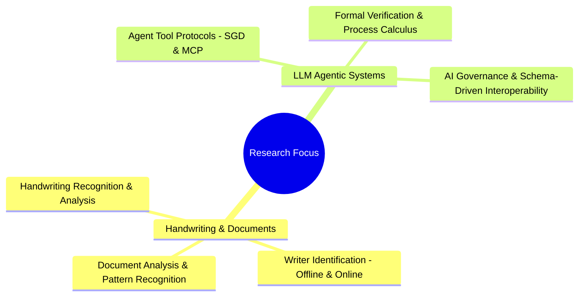
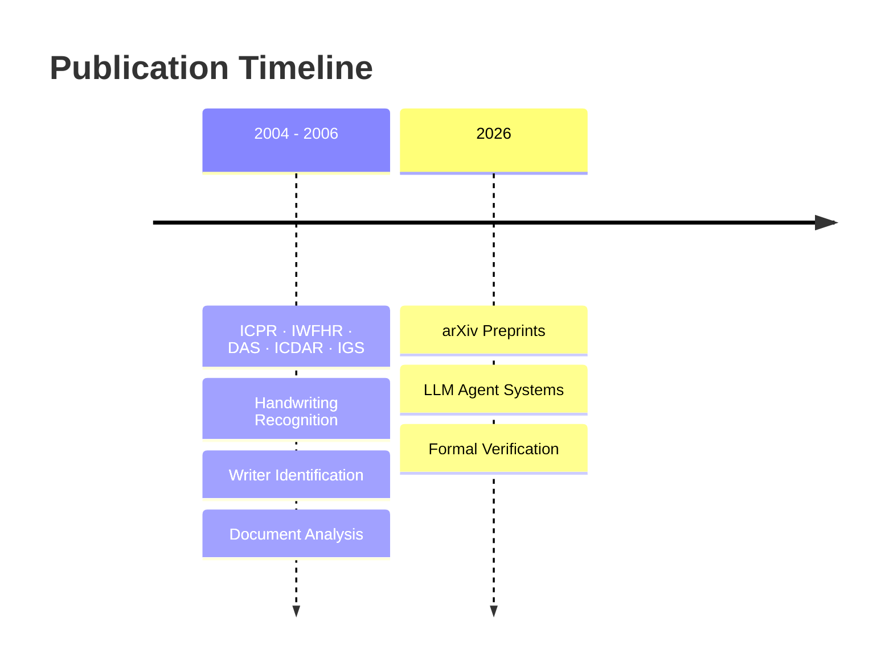

# Andreas Schlapbach's Publications

A curated collection of academic papers and research publications spanning handwriting recognition, document analysis, and LLM agentic systems.

---

## Main Publications

### Core Research Papers

- **MainLDAR.pdf** — Primary research paper on handwriting and document analysis
- **journalPaperFinal.pdf** — Full journal publication with comprehensive findings
- **offWriIdeVerGMM.pdf** — Offline writer identification using Gaussian Mixture Models
- **onlineWIJournal.pdf** — Online writer identification methods and journal findings
- **2602.18764v2.pdf** — The Convergence of SGD and MCP: A New Paradigm for Agentic Interoperability (arXiv, 2026)
- **2603.24747v1.pdf** — Formal Semantics for Agentic Tool Protocols: A Process Calculus Approach (arXiv, 2026)

### Conference Presentations

- **das06.pdf** — Document Analysis and Recognition conference (2006)
- **icdar05.pdf** — International Conference on Document Analysis and Recognition (2005)
- **icpr04.pdf** — International Conference on Pattern Recognition (2004)
- **icpr06.pdf** — International Conference on Pattern Recognition (2006)
- **igs05.pdf** — International Graphonomics Society (2005)
- **iwfhr04.pdf** — International Workshop on Frontiers in Handwriting Recognition (2004)
- **iwfhr06.pdf** — International Workshop on Frontiers in Handwriting Recognition (2006)
- **iwfhr06Slides.pdf** — IWFHR 2006 presentation slides

---

---

## 📋 Document Organization

All papers are organized chronologically by publication year and venue:

- **2004** — ICPR, IWFHR initial conferences
- **2005** — DAS, ICDAR, IGS publications
- **2006** — ICPR, IWFHR follow-up work
- **2026** — arXiv preprints on LLM agentic systems

---

## 🔍 How to Use This Repository

1. **Browse papers** — All PDFs are in the root directory
2. **Review by topic** — Check the conference/journal name for specific focus areas
3. **Access full texts** — Each PDF contains the complete paper and results

---

---

## ℹ️ About

This archive preserves research publications in:

- **Handwriting recognition and analysis**
- **Writer identification and verification**
- **Document image analysis and pattern recognition**
- **LLM agent systems and tool protocols (SGD, MCP)**
- **Formal verification of agentic systems**
- **AI governance and schema-driven interoperability**
