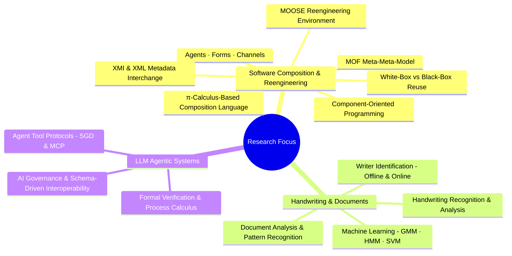
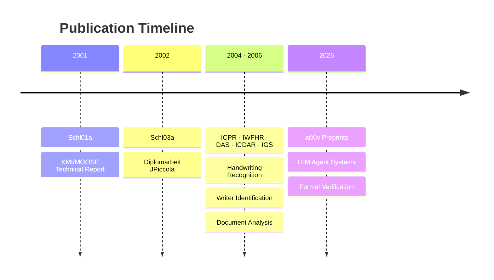

# Andreas Schlapbach's Publications

A curated collection of academic papers and research publications. The early
work explores two foundational ideas in software engineering: the **π-calculus**
as a formal basis for component composition languages, and the **Meta-Object
Facility (MOF)** as a meta-meta-model for language-independent metamodel
interchange via XMI.

Later work applies **machine learning** (Gaussian Mixture Models, Hidden Markov
Models, Support Vector Machines) to handwriting recognition and writer
identification,

Recent research focuses on the design and formal verification of **LLM agentic
systems**, proposing new paradigms for agent interoperability and tool protocol
semantics.

This repository serves as a comprehensive archive of these contributions,
spanning from foundational software composition theories to cutting-edge AI
agent research.

---

## Main Publications

- **Schl01a.pdf** — Generic XMI Support for the MOOSE Reengineering Environment
  (technical report, Universität Bern, June 2001) — implements XMI (XML Metadata
  Interchange) support for MOOSE using the **Meta-Object Facility (MOF)** as a
  meta-meta-model: DTDs are generated directly from the MOF instance of the
  FAMIX metamodel, making the XMI layer generic across any FAMIX-compliant
  language model; supervised by Dr. Stéphane Ducasse and Sander Tichelaar
- **Schl03a.pdf** — Enabling White-Box Reuse in a Pure Composition Language
  (Diplomarbeit, Universität Bern, December 2002) — proposes a migration
  strategy from class inheritance (white-box) to component composition
  (black-box) using Piccola, a scripting language grounded in the
  **π-calculus**; demonstrates how π-calculus-based channel communication and
  agent composition replace inheritance hierarchies; supervised by Prof. Dr. O.
  Nierstrasz and Nathanael Schärli

### Core Research Papers

- **MainLDAR.pdf** — Primary research paper on handwriting and document analysis
- **journalPaperFinal.pdf** — Full journal publication with comprehensive
  findings
- **offWriIdeVerGMM.pdf** — Offline writer identification using Gaussian Mixture
  Models
- **onlineWIJournal.pdf** — Online writer identification methods and journal
  findings
- **2602.18764v2.pdf** — The Convergence of SGD and MCP: A New Paradigm for
  Agentic Interoperability (arXiv, 2026)
- **2603.24747v1.pdf** — Formal Semantics for Agentic Tool Protocols: A Process
  Calculus Approach (arXiv, 2026)

### Conference Presentations

- **das06.pdf** — Document Analysis and Recognition conference (2006)
- **icdar05.pdf** — International Conference on Document Analysis and
  Recognition (2005)
- **icpr04.pdf** — International Conference on Pattern Recognition (2004)
- **icpr06.pdf** — International Conference on Pattern Recognition (2006)
- **igs05.pdf** — International Graphonomics Society (2005)
- **iwfhr04.pdf** — International Workshop on Frontiers in Handwriting
  Recognition (2004)
- **iwfhr06.pdf** — International Workshop on Frontiers in Handwriting
  Recognition (2006)
- **iwfhr06Slides.pdf** — IWFHR 2006 presentation slides

---

---

## 📋 Document Organization

All papers are organized chronologically by publication year and venue:

- **2001** — Technical report on XMI/MOOSE (Universität Bern)
- **2002** — Diplomarbeit on white-box reuse in JPiccola (Universität Bern)
- **2004** — ICPR, IWFHR initial conferences
- **2005** — DAS, ICDAR, IGS publications
- **2006** — ICPR, IWFHR follow-up work
- **2026** — arXiv preprints on LLM agentic systems

---

## 🔍 How to Use This Repository

1. **Browse papers** — All PDFs are in the root directory
2. **Review by topic** — Check the conference/journal name for specific focus
   areas
3. **Access full texts** — Each PDF contains the complete paper and results

---

---

## ℹ️ About

This archive preserves research publications in:

- **Software composition grounded in the π-calculus** (agents, forms, channels)
- **Component-oriented programming and white-box/black-box reuse strategies**
- **XMI/XML metadata interchange, metamodeling, and the MOF meta-meta-model**
- **Machine learning for document analysis** (Gaussian Mixture Models, Hidden
  Markov Models, Support Vector Machines)
- **Handwriting recognition and analysis**
- **Writer identification and verification**
- **Document image analysis and pattern recognition**
- **LLM agent systems and tool protocols (SGD, MCP)**
- **Formal verification of agentic systems**
- **AI governance and schema-driven interoperability**
