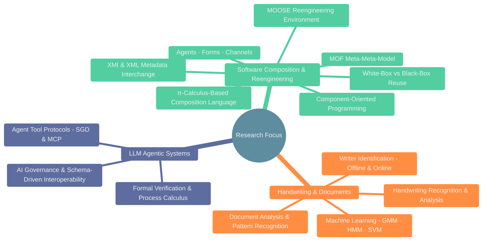
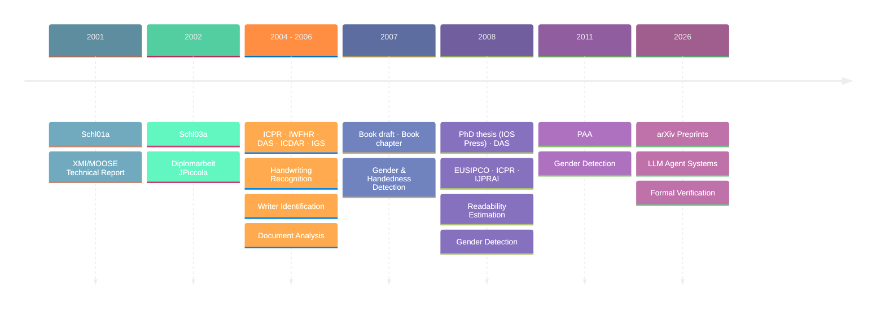

# Andreas Schlapbach's Publications

Welcome to the repository of my research publications. This collection
encompasses a wide range of topics in software engineering, machine learning,
and artificial intelligence, reflecting the evolution of research interests over
the years.

The early work explores two foundational ideas in software engineering: the
**π-calculus** as a formal basis for component composition languages, and the
**Meta-Object Facility (MOF)** as a meta-meta-model for language-independent
meta-model interchange via XMI.

Later work applies **machine learning** (Gaussian Mixture Models, Hidden Markov
Models, Support Vector Machines) to handwriting recognition and writer
identification, contributing to the fields of document analysis and pattern
recognition.

Recent research focuses on the design and formal verification of **LLM Agentic
systems**, proposing new paradigms for agent interoperability and tool protocol
semantics.

This repository serves as a comprehensive archive of these contributions,
spanning from foundational software composition theories to cutting-edge AI
agent research.

If you're interested in connecting professionally, you can find me on
[LinkedIn](https://www.linkedin.com/in/andreas-schlapbach/).

## Publications

### Preprints

1. [Formal Semantics for Agentic Tool Protocols: A Process Calculus Approach](preprints/2603.24747v1.pdf)
   (arXiv, 2026) - Submitted to [CONCUR 2026 (Int. Conf. on Concurrency Theory)](https://confest-2026.github.io/concur/call-for-papers)

2. [The Convergence of SGD and MCP: A New Paradigm for Agentic Interoperability](preprints/2602.18764v2.pdf)
   (arXiv, 2026) - Submitting to [EMPLP 2026 (Conf. on Empirical Methods in Natural Language Processing)](https://2026.emnlp.org)

### Books

3. Writer Identification and Verification (PhD thesis, IOS Press, DISKI series,
   February 2008; ISBN: 978-1-58603-825-0)
4. [Machine Learning in Document Analysis and Recognition](books/MainLDAR.pdf)
   (book draft, 2007)

### Journal Articles

5. Automatic Gender Detection Using on-Line and Off-Line Information (Pattern
   Analysis and Applications, 14(1):87–92, 2011; DOI:
   [10.1007/s10044-010-0178-6](https://doi.org/10.1007/s10044-010-0178-6))
6. [Automatic Gender Detection – Combining On-Line and Off-Line Systems](journal-articles/ijprai2008.pdf)
   (International Journal of Pattern Recognition and Artificial
   Intelligence, 2008)
7. [A Writer Identification System for On-line Whiteboard Data](journal-articles/onlineWIJournal.pdf)
   (Pattern Recognition, 2006)
8. [A Writer Identification and Verification System Using HMM Based Recognizers](journal-articles/journalPaperFinal.pdf)
   (Pattern Analysis and Applications, 2006)

### Book Chapters

9. [Off-line Writer Identification and Verification Using Gaussian Mixture Models](book-chapters/offWriIdeVerGMM.pdf)
   (book chapter, 2007)

### Conference Papers

10. [Automatic Estimation of the Readability of Handwritten Text](conference-papers/eusipco08.pdf)
    (EUSIPCO 2008)
11. [Estimating the Readability of Handwritten Text – A Support Vector Regression Based Approach](conference-papers/icpr08.pdf)
    (ICPR 2008)
12. Writer-Dependent Recognition of Handwritten Whiteboard Notes in Smart
    Meeting Room Environments (DAS 2008; DOI:
    [10.1109/DAS.2008.8](https://doi.org/10.1109/DAS.2008.8)) with co-author:
    [Samy Bengio](https://bengio.abracadoudou.com/)
13. Automatic Detection of Gender and Handedness from On-Line Handwriting (2007)
14. [Writer Identification for Smart Meeting Room Systems](conference-papers/LNCS-3872.pdf)
    (DAS 2006, LNCS 3872, pp. 186–195; also available as
    [author preprint](conference-papers/das06.pdf))
15. [Off-line Writer Identification Using Gaussian Mixture Models](conference-papers/icpr06.pdf)
    (ICPR 2006)
16. [Off-Line Writer Verification: A Comparison of a Hidden Markov Model (HMM) and a Gaussian Mixture Model (GMM) Based System](conference-papers/iwfhr06.pdf)
    (IWFHR 2006)
17. [Improving Writer Identification by Means of Feature Selection and Extraction](conference-papers/icdar05.pdf)
    (ICDAR 2005)
18. [Writer Identification Using an HMM-Based Handwriting Recognition System: To Normalize the Input or Not?](conference-papers/igs05.pdf)
    (IGS 2005)
19. [Off-line Handwriting Identification Using HMM Based Recognizers](conference-papers/icpr04.pdf)
    (ICPR 2004)
20. [Using HMM Based Recognizers for Writer Identification and Verification](conference-papers/iwfhr04.pdf)
    (IWFHR 2004)

### Theses & Technical Reports

21. Writer Identification and Verification] (PhD thesis, Universität Bern, 2008
    — published as book; see entry 3)
22. [Enabling White-Box Reuse in a Pure Composition Language](theses/Schl03a.pdf)
    (Master thesis, Universität Bern, December 2002)
23. [Generic XMI Support for the MOOSE Reengineering Environment](theses/Schl01a.pdf)
    (Bachelor thesis, Universität Bern, June 2001)

### Presentations

24. [IWFHR 2006 presentation slides](presentations/iwfhr06Slides.pdf)

## Document Organization

All papers are organized chronologically by publication year and venue:

- **2026** — arXiv preprints on LLM Agentic systems
- **2011** — Pattern Analysis and Applications gender detection journal paper
- **2008** — PhD thesis book (IOS Press/DISKI); DAS whiteboard recognition;
  EUSIPCO, ICPR readability estimation; IJPRAI gender detection
- **2007** — Book draft on machine learning in document analysis; book chapter
  on GMM-based writer identification; gender/handedness detection
- **2006** — DAS, ICPR, IWFHR follow-up work
- **2005** — ICDAR, IGS publications
- **2004** — ICPR, IWFHR initial conferences
- **2002** — Master thesis on white-box reuse in _JPiccola_ (Universität Bern)
- **2001** — Bachelor thesis on XMI/MOOSE, a reengineering environment
  (Universität Bern)

## How to Use This Repository

1. **Browse papers** — All PDFs are in the root directory
2. **Review by topic** — Check the conference/journal name for specific focus
   areas
3. **Access full texts** — Each PDF contains the complete paper and results

## About

This archive preserves research publications spanning:

- **Software composition** grounded in the π-calculus (agents, forms, channels)
  and component-oriented programming
- **Meta-modeling** via XMI/XML metadata interchange and the MOF meta-meta-model
- **Reuse strategies** including white-box and black-box approaches in
  reengineering environments
- **Machine learning** applied to document analysis using Gaussian Mixture
  Models, Hidden Markov Models, and Support Vector Machines
- **Handwriting recognition, analysis, and writer identification** (offline and
  online)
- **Document image analysis** and pattern recognition
- **LLM agentic systems**, including tool protocols (SGD, MCP) and formal
  verification
- **AI governance** and schema-driven interoperability
